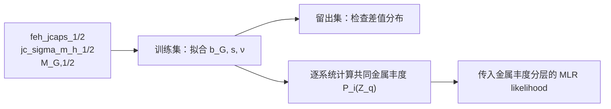
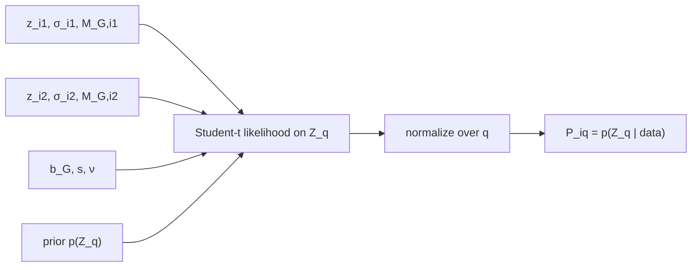

# 最终 XP 金属丰度观测模型

$$
\boxed{\text{Student-t 核心}+b_G+s}
$$

## 输入

$$
z_{i1}=\texttt{feh\_jcaps\_1},\qquad
z_{i2}=\texttt{feh\_jcaps\_2},
$$

$$
\sigma_{i1}=\texttt{jc\_sigma\_m\_h\_1},\qquad
\sigma_{i2}=\texttt{jc\_sigma\_m\_h\_2}.
$$

## 单星观测模型

$$
a_{ij}=\sqrt{\sigma_{ij}^2+s^2},
$$

$$
\boxed{
z_{ij}\mid Z_i,M_{G,ij},\theta
\sim
t_\nu\!\left(
Z_i+b_G(M_{G,ij}),\;a_{ij}
\right)
}
$$

其中

$$
\theta=\{b_G,s,\nu\}.
$$

## 绝对星等偏差

$$
M_G^{\rm knot}=[3.5,6.0,8.5,11.0,13.5],
$$

$$
b_G(8.5)=0,
$$

$$
b_G(M_G)=\operatorname{linear\ interpolation}
\left(M_G^{\rm knot},b^{\rm knot}\right).
$$

当前拟合值为

$$
b^{\rm knot}=
[0.11213,\;0.04988,\;0,\;-0.31031,\;-0.53320]\ {\rm dex}.
$$

## 双星差值似然

$$
d_i=z_{i2}-z_{i1},
$$

$$
r_i=d_i-
\left[b_G(M_{G,i2})-b_G(M_{G,i1})\right].
$$

共同金属丰度 $Z_i$ 在差值中消去。令 $t_\nu(x;0,a)$ 表示位置为零、尺度为 $a$ 的 Student-t 密度，则

$$
\boxed{
\mathcal L_i(\theta)
=p(r_i\mid\theta)
=\int_{-\infty}^{+\infty}
t_\nu(x;0,a_{i1})
t_\nu(x+r_i;0,a_{i2})\,dx
}
$$

积分使用数值卷积，不把两个 Student-t 的差近似成另一个 Student-t。

## 参数拟合

$$
\boxed{
\hat\theta=arg\max_\theta
\sum_{i\in\mathrm{train}}
\log\mathcal L_i(\theta)
}
$$

当前结果为

$$
\boxed{s=0.04647\ {\rm dex\ per\ star}},
$$

$$
\boxed{\nu=2.52365}.
$$

对应的差值层面额外方差为

$$
2s^2,
$$

标准化残差写为

$$
\boxed{
q_i=
\frac{z_{i2}-z_{i1}-[b_G(M_{G,i2})-b_G(M_{G,i1})]}
{\sqrt{\sigma_{i1}^2+\sigma_{i2}^2+2s^2}}
}.
$$

## 共同金属丰度后验

给定金属丰度网格 $Z_q$ 和先验 $p(Z_q)$：

$$
\widetilde P_{iq}
=p(Z_q)
\prod_{j=1}^{2}
t_\nu\!\left(
z_{ij};
Z_q+b_G(M_{G,ij}),
\sqrt{\sigma_{ij}^2+s^2}
\right),
$$

$$
\boxed{
P_{iq}=p(Z_q\mid z_{i1},z_{i2})
=\frac{\widetilde P_{iq}}
{\sum_{q'}\widetilde P_{iq'}}
}.
$$

传入后续 MLR 模型的是完整离散分布 $P_{iq}$。

## 文件

$$
\texttt{src/examples/fit\_xp\_simple\_student\_t.py}
$$

$$
\texttt{src/examples/plot\_xp\_final\_student\_t\_model.py}
$$

$$
\texttt{results/xp\_simple\_student\_t\_feh\_jcaps\_20260910/}
$$
