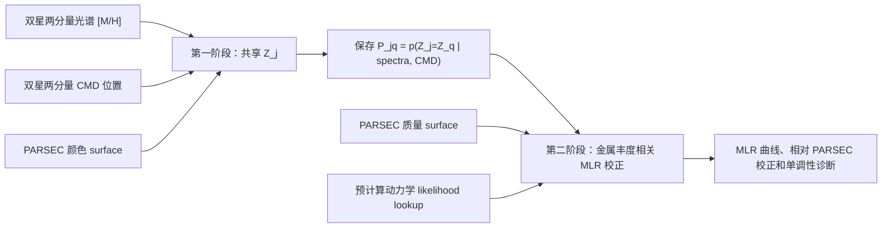
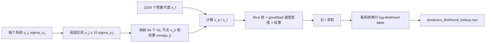
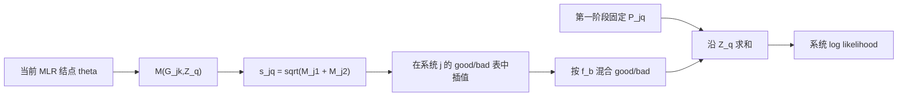

# 层次金属丰度—MLR 模型与动力学 lookup 说明

## 1. 计算结构

这个实验保持两阶段 modular/cut inference。第一阶段的后验只通过每个系统的离散金属丰度概率 $P_{jq}$ 传给第二阶段；第二阶段不会重复加入光谱、CMD 或总体金属丰度 likelihood。

## 当前数据前提：只使用未校正 XP 金属丰度

本项目只使用输入表中的未校正 XP 金属丰度及其未校正误差：

- `feh_jcaps_1`, `feh_jcaps_2`
- `jc_sigma_m_h_1`, `jc_sigma_m_h_2`

不得使用 `jc_m_h_fit_cal_*`、`jc_sigma_m_h_cal_*` 或其他基于双星金属丰度相等假设得到的校正列。那些列已经使用了本模型要重新估计的双星一致性信息；再次使用会重复计算同一信息，并使 calibration 与输入数据循环耦合。

如果输入表缺少上述四列，运行应直接报告缺失列。不能静默替换为 calibrated、inflated 或其他误差列。



## 2. 索引、数据和公共符号

| 符号 | 含义 |
|---|---|
| $j=1,\ldots,N$ | 双星系统索引 |
| $k\in\{1,2\}$ | 同一系统的两个恒星分量 |
| $q=1,\ldots,Q$ | 潜在金属丰度网格索引；当前 $Q=81$ |
| $Z_j$ | 系统 $j$ 的共享潜在金属丰度，单位 dex |
| $Z_q$ | 固定网格 $[-1,0.6]$ 上第 $q$ 个值 |
| $G_{jk}$ | 第 $k$ 个分量的绝对 Gaia $G$ 星等，即代码中的 `absg` |
| $\hat z_{jk}$ | 光谱金属丰度中心值，读取 `feh_jcaps_1/2` |
| $\sigma_{z,jk}$ | 未校正 XP 光谱金属丰度误差，读取 `jc_sigma_m_h_1/2` |
| $C_{jk}$ | 消光改正后的观测颜色 `bp_rp0_1/2` |
| $\sigma_{C,jk}$ | 由 BP/RP flux-over-error 传播得到的 formal 颜色误差 |
| $t_\nu(x\mid\mu,\sigma)$ | 位置为 $\mu$、尺度为 $\sigma$、自由度为 $\nu$ 的 Student-t 密度 |

颜色 formal error 使用

$$
\sigma_{C,jk}=\frac{2.5}{\ln 10}
\sqrt{\mathrm{SNR}_{BP,jk}^{-2}+\mathrm{SNR}_{RP,jk}^{-2}},
$$

其中 $\mathrm{SNR}_{BP,jk}$ 和 $\mathrm{SNR}_{RP,jk}$ 分别是 Gaia BP、RP 的 flux-over-error。

## 3. 第一阶段：光谱系统差与 CMD

### 3.1 光谱 good component

在给定共享金属丰度 $Z_j$ 时，两个分量分别服从

$$
\hat z_{jk}\sim t_4\!\left(
z_{\rm off}+s_Z Z_j+b_G\frac{G_{jk}-8.5}{5},
\sqrt{\sigma_{z,jk}^2+s_z^2}
\right).
$$

| 符号 | 含义 | 先验 |
|---|---|---|
| $z_{\rm off}$ | 金属丰度零点偏移 | $\mathcal N(0,0.3)$ |
| $s_Z>0$ | 观测金属丰度相对潜在金属丰度的尺度 | $\mathrm{LogNormal}(0,0.25)$ |
| $b_G$ | 随绝对星等变化的观测系统差，单位 dex/5 mag | $\mathcal N(0,0.3)$ |
| $s_z>0$ | formal 光谱误差之外的额外误差地板 | $\mathrm{HalfNormal}(0.3)$ |

因此“观测减潜在”的系统差为

$$
\Delta z(G,Z)=z_{\rm off}+(s_Z-1)Z+b_G\frac{G-8.5}{5}.
$$

### 3.2 光谱 bad component

每一次分量测量都有独立的 good/bad 指示变量。边缘化该指示变量后，光谱密度为

$$
p(\hat z_{jk}\mid Z_j)=
(1-\pi_z)t_4(\hat z_{jk}\mid\mu_{jk}(Z_j),\sigma_{jk,\rm eff})
+\pi_z t_2(\hat z_{jk}\mid z_{\rm med},s_{\rm robust}),
$$

其中

$$
\mu_{jk}(Z)=z_{\rm off}+s_ZZ+b_G(G_{jk}-8.5)/5,
\qquad
\sigma_{jk,\rm eff}=\sqrt{\sigma_{z,jk}^2+s_z^2}.
$$

$z_{\rm med}$ 是所有两分量观测值合并后的中位数，
$s_{\rm robust}=\max[0.5,1.4826\,\mathrm{MAD}]$，两者在采样前固定；bad 密度不依赖 $Z_j$。全局坏测量率为 $\pi_z\sim\mathrm{Beta}(1,4)$。

### 3.3 CMD likelihood

从原始 PARSEC CSV 构造颜色 surface $C_{\rm P}(G,Z)$。每个分量使用

$$
C_{jk}\sim t_4\!\left[
C_{\rm P}(G_{jk},Z_j),
\sqrt{\sigma_{C,jk}^2+s_C^2}
\right],
\qquad s_C\sim\mathrm{HalfNormal}(0.1).
$$

这里没有自由颜色偏移，即固定 $\delta C=0$。$s_C$ 是 PARSEC surface、数据误差和未建模天体物理散布之外的合并额外散布。

### 3.4 总体金属丰度与离散边缘化

总体密度使用六个固定截断高斯 basis：

$$
p_{\rm pop}(Z)=\sum_{h=1}^{6}w_h B_h(Z),
\qquad \boldsymbol w\sim\mathrm{Dirichlet}(1,\ldots,1).
$$

$B_h$ 的中心在 $[-1,0.6]$ 内等距放置，标准差固定为 $1.6/6$ dex，并在该区间内重新归一化。$w_h\ge 0$ 且 $\sum_h w_h=1$。

系统 $j$ 在网格点 $Z_q$ 的未归一化权重是

$$
W_{jq}=\Delta Z_q\,p_{\rm pop}(Z_q)
\prod_{k=1}^{2}
p(\hat z_{jk}\mid Z_q)\,
p(C_{jk}\mid G_{jk},Z_q),
$$

其中 $\Delta Z_q$ 是梯形积分权重。保存给第二阶段的是对第一阶段全局参数后验抽样取平均后的归一化概率质量

$$
P_{jq}=p(Z_j=Z_q\mid \mathrm{spectra,CMD}),
\qquad \sum_{q=1}^{Q}P_{jq}=1.
$$

## 4. 第二阶段：相对 PARSEC 的 MLR 校正

PARSEC 基准质量 surface 记为 $M_{\rm P}(G,Z)$。校正后的单星质量为

$$
\log_{10}\frac{M(G,Z)}{M_\odot}
=\log_{10}\frac{M_{\rm P}(G,Z)}{M_\odot}
+f_0(G)+Zf_Z(G),
$$

等价地，

$$
M(G,Z)=M_{\rm P}(G,Z)10^{f_0(G)+Zf_Z(G)}.
$$

$f_0$ 和 $f_Z$ 都是在 $G=[3.5,8.5,13.5]$ 三个结点之间线性插值的函数。三个 $f_0$ 结点分别使用 $\mathcal N(0,0.10)$ 先验，三个 $f_Z$ 结点分别使用 $\mathcal N(0,0.15)$ 先验。各自唯一的二阶结点差满足

$$
f(G_1)-2f(G_2)+f(G_3)\sim\mathcal N(0,0.05).
$$

太阳锚点为

$$
M(G=4.67,Z=0)=1.00\pm0.01\,M_\odot.
$$

对系统 $j$ 和金属丰度点 $Z_q$，定义

$$
s_{jq}=\sqrt{\frac{M(G_{j1},Z_q)+M(G_{j2},Z_q)}{M_\odot}}.
$$

$s_{jq}$ 是总质量平方根，也是动力学速度分布的尺度因子。

## 5. 原始动力学积分为什么会出问题

| 符号 | 含义 |
|---|---|
| $u_j$ | 系统 $j$ 的观测投影速度统计量，代码中为 `u` |
| $\sigma_{u,j}$ | $u_j$ 的观测误差，代码中为 `u_sigma` |
| $\tilde u$ | 除去总质量尺度后的无量纲动力学速度 |
| $v=s\tilde u$ | 给定质量尺度后的“真实”速度统计量 |
| $R(u\mid v,\sigma)$ | 非中心参数为 $v$、尺度为 $\sigma$ 的 Rice 观测密度 |
| $p_g(\tilde u)$ | 正常双星的无量纲速度密度 |
| $p_b(\tilde u)$ | 动力学异常分量的无量纲速度密度 |
| $\tilde u_{\max}=80$ | 数值模型支持域上限 |

Rice 密度为

$$
R(u\mid v,\sigma)=
\frac{u}{\sigma^2}
\exp\!\left[-\frac{u^2+v^2}{2\sigma^2}\right]
I_0\!\left(\frac{uv}{\sigma^2}\right),\qquad u\ge0,
$$

其中 $I_0$ 是零阶第一类修正 Bessel 函数。代码通过 exponentially scaled $I_0$ 在 log space 中稳定计算它。

正常双星速度密度固定为

$$
p_g(\tilde u)=A\tilde u\,
\exp\!\left[-B\tilde u^2-
\exp\!\left(\frac{\tilde u-u_c}{C}\right)\right],
$$

其中 $A=5.434\times10^{-3}$、$B=2.544\times10^{-3}$、$u_c=35.67$、$C=3.100$。

旧实现直接在 $\tilde u\in[0,80]$ 上放置 64 个全局 Gauss–Legendre 节点：

$$
L_{g,j}(s)=\frac{1}{s}
\int_0^{80}p_g(\tilde u)
R\!\left(\frac{u_j}{s}\middle|\tilde u,\frac{\sigma_{u,j}}{s}\right)d\tilde u.
$$

当 $\sigma_{u,j}/s\ll1$ 时，Rice 核在 $\tilde u$ 空间很窄；固定在整个 $[0,80]$ 的 64 个节点可能完全跨过峰值。于是积分误差随 $s$ 振荡。单个系统的小振荡在全样本中相加后会形成尖锐的伪局部模态，导致 NUTS 链之间落入不同模态、tree depth 饱和和极端 $\hat R$。

## 6. lookup 的变量替换和预计算原理

使用 Rice 密度的尺度关系并令 $v=s\tilde u$，上式可写成

$$
\boxed{
L_{g,j}(s)=
\int_0^{80s}
R(u_j\mid v,\sigma_{u,j})
\frac{1}{s}p_g\!\left(\frac{v}{s}\right)dv
}.
$$

这个形式的关键是：Rice 核的位置和宽度现在固定在观测尺度 $u_j,\sigma_{u,j}$，不会再随候选质量 $s$ 收窄或移动。因此每个系统只需围绕 $u_j$ 放置局部积分节点。

### 6.1 局部节点

对系统 $j$，默认积分区间为

$$
a_j=\max(0,u_j-K\sigma_{u,j}),\qquad
b_j=u_j+K\sigma_{u,j},\qquad K=10.
$$

区间外遗漏的是 Rice 核的极小尾部。令 $x_r,w_r$ 为标准区间 $[-1,1]$ 上的 64 点 Gauss–Legendre 节点和权重，则

$$
v_{jr}=m_j+h_jx_r,\qquad
\omega_{jr}=h_jw_r,
$$

其中 $m_j=(a_j+b_j)/2$，$h_j=(b_j-a_j)/2$。这 64 个点按每个系统自己的误差宽度缩放，而不是分散在统一的 $[0,80]$ 上。

### 6.2 质量尺度网格

在几何等距网格 $s_\ell$ 上预计算；默认范围为

$$
s_\ell\in[0.25,2.5],\qquad L=1024
$$

（quick 模式为 512 点）。正常分量表为

$$
L^{(g)}_{j\ell}\approx
\sum_{r=1}^{64}\omega_{jr}
R(u_j\mid v_{jr},\sigma_{u,j})
\frac{1}{s_\ell}p_g\!\left(\frac{v_{jr}}{s_\ell}\right)
\mathbf 1\!\left(0<\frac{v_{jr}}{s_\ell}\le80\right).
$$

异常分量采用固定的正半轴截断高斯

$$
p_b(\tilde u)=
\frac{\phi[(\tilde u-\mu_b)/\sigma_b]}
{\sigma_b\Phi(\mu_b/\sigma_b)},\qquad \tilde u\ge0,
$$

其中 $\phi$ 和 $\Phi$ 分别是标准正态 PDF 和 CDF，默认 $\mu_b=40$、$\sigma_b=13$。对应表为

$$
L^{(b)}_{j\ell}\approx
\sum_{r=1}^{64}\omega_{jr}
R(u_j\mid v_{jr},\sigma_{u,j})
\frac{1}{s_\ell}p_b\!\left(\frac{v_{jr}}{s_\ell}\right)
\mathbf 1\!\left(0\le\frac{v_{jr}}{s_\ell}\le80\right).
$$

预计算保存的是 `log_good[j,l]` 和 `log_bad[j,l]`，以减少下溢并方便采样时做 log-sum-exp。



### 6.3 MCMC 中只做一维插值

每次 NUTS 评价先由 MLR 参数得到 $s_{jq}$，再对系统 $j$ 自己的表沿 $s$ 方向线性插值 log likelihood：

$$
\ell^{(g)}_{jq}=\operatorname{interp}
\bigl(s_{jq};\{s_\ell,\log L^{(g)}_{j\ell}\}\bigr),
$$

$$
\ell^{(b)}_{jq}=\operatorname{interp}
\bigl(s_{jq};\{s_\ell,\log L^{(b)}_{j\ell}\}\bigr).
$$

只有动力学异常比例仍在第二阶段采样：

$$
f_b\sim\mathrm{Beta}(3,12),
$$

$$
\log L_{jq}=\operatorname{logaddexp}
\left[\log(1-f_b)+\ell^{(g)}_{jq},
\log f_b+\ell^{(b)}_{jq}\right].
$$

异常分量形状 $\mu_b,\sigma_b$ 必须固定，因为改变它们就会改变整张 bad lookup。最终每个系统对第二阶段的贡献严格为

$$
\boxed{
\log L_j(\theta)=
\log\sum_{q=1}^{Q}P_{jq}\,L_{jq}(\theta)
},
$$

其中 $\theta$ 表示 MLR 结点和 $f_b$。这个式子没有再次乘入 $p_{\rm pop}$、光谱或 CMD likelihood。

NUTS 从无校正的 PARSEC 基线初始化：$f_0=f_Z=0$、$f_b=0.2$。这是因为 NumPyro 默认的无界参数初值范围远宽于这里的 $0.10$--$0.15$ dex 先验尺度，可能把初始质量推到 lookup 范围之外，使初始 log likelihood 变成 $-\infty$。运行采样前，代码会直接计算并打印这个零校正基线的动力学 log likelihood；如果它仍非有限，程序会报告对应的原始数据行号。



## 7. 数据一致性和 lookup 边界

lookup 文件保存原始数据行号、质量尺度网格、固定异常分量参数以及由 `row_indices`、`u`、`u_sigma` 共同计算的 SHA-256 digest。MLR 阶段会逐项验证，防止把 quick 表、不同筛选版本或不同数据文件混用。

当 $s_{jq}$ 超出 lookup 的 $[s_{\min},s_{\max}]$ 时，代码不做静默 clipping 或外推，而是令该点 log likelihood 为 $-\infty$。若 posterior 接近边界，应使用更宽范围重新生成 lookup，例如 `--lookup-sqrt-mass-min 0.20 --lookup-sqrt-mass-max 3.0`。扩大 $s$ 范围不会增加 MCMC 单步积分成本，但可能需要相同或更多的质量网格点来维持插值精度。

## 8. 服务器运行方式

已有 calibration 结果可以直接复用，不必重新运行第一阶段。为了保留此前三天运行得到的旧 MLR 输出，建议将新结果写入新目录，并用 `--metallicity-posterior` 指向旧目录中可复用的第一阶段文件。全数据示例：

```bash
conda run -n dyn python src/examples/run_hierarchical_metallicity_test.py \
  --stage lookup \
  --metallicity-posterior results/hierarchical_metallicity_minimal/latent_metallicity_weights.npz \
  --output-dir results/hierarchical_metallicity_minimal_lookup

conda run -n dyn python src/examples/run_hierarchical_metallicity_test.py \
  --stage mlr \
  --metallicity-posterior results/hierarchical_metallicity_minimal/latent_metallicity_weights.npz \
  --output-dir results/hierarchical_metallicity_minimal_lookup
```

quick 目录需要在两个命令中都加 `--quick`：

```bash
conda run -n dyn python src/examples/run_hierarchical_metallicity_test.py \
  --stage lookup --quick \
  --metallicity-posterior results/hierarchical_metallicity_minimal_quick/latent_metallicity_weights.npz \
  --output-dir results/hierarchical_metallicity_minimal_quick_lookup

conda run -n dyn python src/examples/run_hierarchical_metallicity_test.py \
  --stage mlr --quick \
  --metallicity-posterior results/hierarchical_metallicity_minimal_quick/latent_metallicity_weights.npz \
  --output-dir results/hierarchical_metallicity_minimal_quick_lookup
```

从头执行全部阶段可使用 `--stage all`，执行顺序为 calibration → lookup → MLR。
如果确实希望在原目录内更新第二阶段，也可以省略 `--metallicity-posterior` 并把 `--output-dir` 设为原目录。

如果 MCMC 已经完成、只需要重新生成 MLR 图和 corner 图，不必重跑采样：

```bash
conda run -n dyn python src/examples/run_hierarchical_metallicity_test.py \
  --stage plot \
  --output-dir results/hierarchical_metallicity_minimal_lookup
```

主要 lookup 调节参数：

| 参数 | 默认值 | 作用 |
|---|---:|---|
| `--lookup-mass-points` | full 1024 / quick 512 | $s$ 网格点数 |
| `--lookup-sqrt-mass-min` | 0.25 | $s$ 网格下界 |
| `--lookup-sqrt-mass-max` | 2.5 | $s$ 网格上界 |
| `--lookup-velocity-nodes` | 64 | 每个系统的局部 Gauss–Legendre 节点数 |
| `--lookup-sigma-extent` | 10 | 局部区间半宽 $K\sigma_u$ |
| `--lookup-system-chunk` | 128 | GPU/CPU 分块系统数；显存不足时减小 |
| `--outlier-u0` | 40 | 固定异常分量中心 $\mu_b$ |
| `--outlier-sigma` | 13 | 固定异常分量宽度 $\sigma_b$ |

新文件包括：

- `dynamics_likelihood_lookup.npz`：逐系统 good/bad log likelihood 表；
- `dynamics_likelihood_lookup_diagnostics.json`：网格、积分和文件信息；
- `mlr_lookup_metadata.json`：MLR 使用的 lookup 配置副本；
- `mlr_corner.png`：六个 MLR 结点参数和动力学异常比例的 corner 图；
- 原有 `mlr_mcmc.npz`、`mlr_summary.csv`、`mlr_diagnostics.json`、`mlr_correction_grid.*`、`mlr_correction.png` 和单调性诊断。

## 9. 检查建议

1. 先运行 quick lookup 和 quick MLR，确认 lookup digest 验证通过。
2. 检查 `dynamics_likelihood_lookup_diagnostics.json` 中没有 NaN/Inf，且 posterior 质量尺度没有靠近 lookup 边界。
3. full MLR 至少检查每条链的 $\hat R$、ESS、divergence、BFMI 和最大 tree depth；不能只看曲线图。
4. 对少量窄误差系统，把 lookup 值与围绕 $u_j\pm12\sigma_{u,j}$ 的高精度自适应积分比较。当前单元测试在 $\sigma_u=0.2$ 的窄核案例中要求相对误差小于 $2\times10^{-4}$。
5. 若改变 $u$、$\sigma_u$、样本筛选、异常分量形状或积分设置，必须重新生成 lookup；仅改变 MLR 先验、warmup、samples 或 chains 时可以复用。
