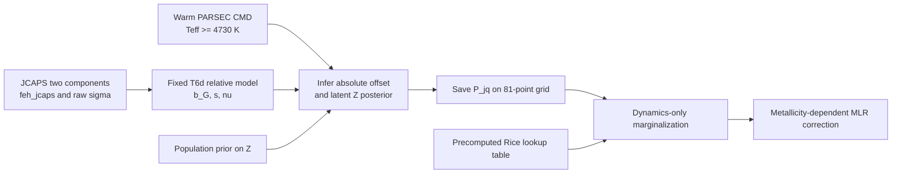
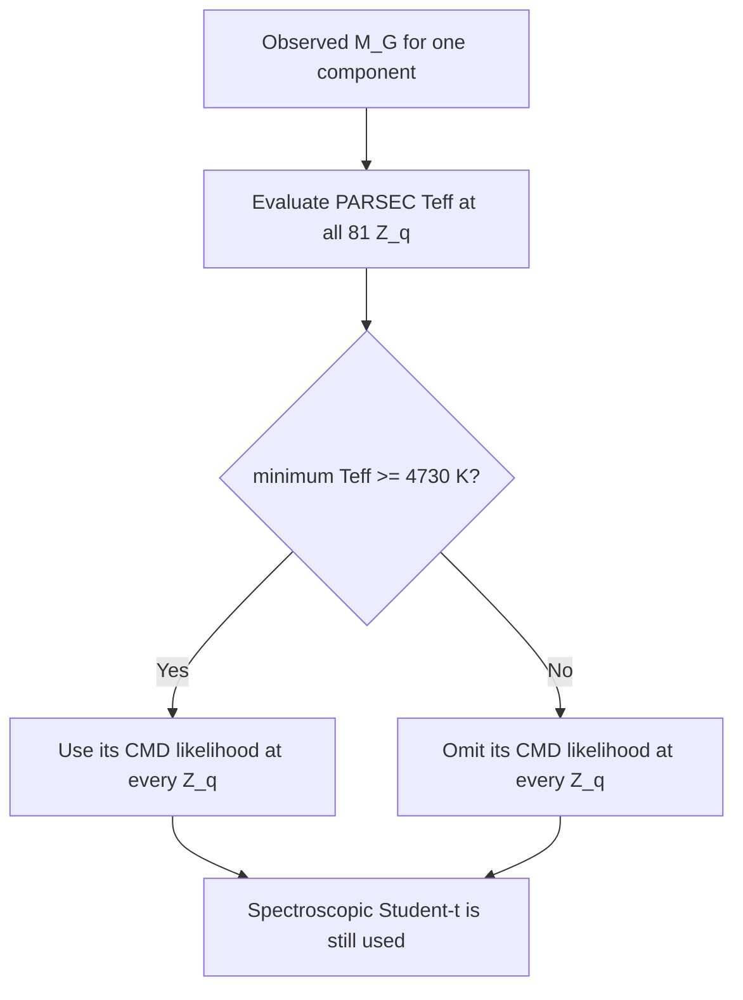
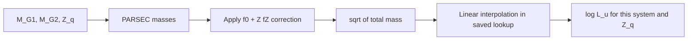

# T7：JCAPS Student-t、暖星 CMD 绝对锚点与动力学 MLR

## 1. 这次改动解决什么问题

T6d 已经用宽双星两个成员的金属丰度差，确定了 JCAPS 金属丰度随绝对星等变化的相对系统差，以及单星测量分布的额外尺度和厚尾程度。但是，双星差值会消去两颗星共享的真实金属丰度，因此不能单独确定整个 JCAPS 金属丰度标尺相对真实金属丰度的共同平移。

T7 保留 T6d 的相对校正不动，再用 PARSEC 主序暖星 CMD 位置确定这个共同平移。每个双星系统的完整金属丰度后验随后作为固定输入，进入动力学 MLR 阶段。



## 2. 下标、观测量和未知量

- $j$ 表示一个双星系统。
- $k\in\{1,2\}$ 表示该系统的第 1 或第 2 个成员。
- $q$ 表示固定金属丰度网格上的一个点。
- $z_{jk}$ 是单颗星的 JCAPS 观测金属丰度，单位为 dex。
- $\sigma_{jk}$ 是该观测给出的未校正单星误差，单位为 dex。
- $M_{G,jk}$ 是单颗星的 Gaia $G$ 波段绝对星等。
- $C_{jk}$ 是消光改正后的 Gaia 颜色 $(G_{\rm BP}-G_{\rm RP})_0$，单位为 mag。
- $Z_j$ 是双星系统两颗星共享的潜在真实金属丰度，也是 PARSEC surface 使用的 $[M/H]$。
- $\Delta_z$ 是 T7 新拟合的 JCAPS 绝对零点偏移，代码名为 `z_offset`，单位为 dex。

实际输入严格使用：

$$
z_{j1}=\texttt{feh\_jcaps\_1},\qquad
z_{j2}=\texttt{feh\_jcaps\_2},
$$

$$
\sigma_{j1}=\texttt{jc\_sigma\_m\_h\_1},\qquad
\sigma_{j2}=\texttt{jc\_sigma\_m\_h\_2}.
$$

不使用 `jc_m_h_fit_*`、`jc_m_h_fit_cal_*` 或 `jc_sigma_m_h_cal_*`。这些列已经利用“双星两成员金属丰度相同”的信息做过校正；再次把它们放进共享 $Z_j$ 的似然会重复使用同一信息，形成循环约束。

## 3. 固定继承的 T6d 相对观测模型

T6d 的星等结点为

$$
M_G^{\rm knot}=[3.5,\ 6.0,\ 8.5,\ 11.0,\ 13.5].
$$

相对偏差 $b_G(M_G)$ 在以下结点值之间作线性插值：

$$
b_G^{\rm knot}=
[0.1121285,\ 0.0498776,\ 0,\ -0.3103054,\ -0.5332039]\ {\rm dex}.
$$

定义 $b_G(8.5)=0$，所以 $b_G$ 只描述不同绝对星等之间的相对偏差。T6d 拟合得到的单星额外尺度和 Student-t 自由度也固定为

$$
s=0.0464650\ {\rm dex},
$$

$$
\nu=2.5236494.
$$

T7 不重新拟合这三个量，而把它们作为 plug-in calibration 使用。因此当前结果没有传播 T6d 中 $b_G$、$s$ 和 $\nu$ 的拟合不确定性。

## 4. 加入绝对零点后的单星金属丰度似然

单颗星的有效尺度是

$$
a_{jk}=\sqrt{\sigma_{jk}^{2}+s^{2}}.
$$

T7 使用的观测模型为

$$
\boxed{
z_{jk}\mid Z_j,\Delta_z
\sim
t_{\nu}\!\left(
Z_j+\Delta_z+b_G(M_{G,jk}),\ a_{jk}
\right)
}.
$$

这里的位置参数说明了 `z_offset` 的符号：

$$
\Delta_z>0
\quad\Longrightarrow\quad
\text{JCAPS 在固定真实 }Z_j\text{ 下整体报得更高}.
$$

先验为

$$
\Delta_z\sim\mathcal N(0,0.3^2)\ {\rm dex}.
$$

与更早的最简模型不同，这里没有 `z_scale`、自由的线性 `z_mag_slope`、`z_extra_scatter` 或 good/bad mixture。厚尾异常值由同一个自由度为 $\nu$ 的 Student-t 分布处理。

## 5. 金属丰度总体先验

金属丰度只在 81 个固定点上计算：

$$
Z_q\in[-1.0,0.6],\qquad q=1,\ldots,81.
$$

总体先验由 6 个固定、在上述区间截断的高斯 basis 组成：

$$
p_{\rm pop}(Z)
=
\sum_{r=1}^{6}w_r\,\phi_r^{\rm trunc}(Z),
$$

$$
(w_1,\ldots,w_6)\sim{\rm Dirichlet}(1,\ldots,1),
\qquad
\sum_{r=1}^{6}w_r=1.
$$

$w_r$ 是需要拟合的总体混合权重。$\phi_r^{\rm trunc}$ 的中心在 $[-1,0.6]$ 内均匀放置，宽度固定为区间宽度的 $1/6$。离散积分使用梯形积分权重 $\Delta Z_q$，端点权重为内部点的一半。

## 6. PARSEC CMD 绝对金属丰度锚点

PARSEC 原始表先按现有模型的年龄范围选取，再构造两个二维 surface：

$$
C_{\rm PARSEC}(M_G,Z),
$$

$$
T_{{\rm eff},{\rm PARSEC}}(M_G,Z).
$$

颜色 surface 给出主序位置，温度 surface 只用于决定哪颗星可以贡献 CMD 似然。观测颜色的 formal error 由 BP/RP flux-over-error 传播：

$$
\sigma_{C,jk}
=
\frac{2.5}{\ln 10}
\sqrt{
\left({\rm SNR}_{{\rm BP},jk}\right)^{-2}
+
\left({\rm SNR}_{{\rm RP},jk}\right)^{-2}
}.
$$

CMD 额外散度 $s_C$ 由本阶段拟合：

$$
s_C\sim{\rm HalfNormal}(0.1\ {\rm mag}).
$$

对被选中的星，CMD 似然是

$$
\boxed{
C_{jk}\mid Z_j
\sim
t_4\!\left[
C_{\rm PARSEC}(M_{G,jk},Z_j),
\sqrt{\sigma_{C,jk}^{2}+s_C^{2}}
\right]
}.
$$

颜色零点固定为零，没有额外的 $\delta C$。因此这里把暖星 PARSEC CMD 当作绝对参照；最后得到的 $\Delta_z$ 应理解为“相对当前 PARSEC 颜色 surface 的 JCAPS 零点”，而不是完全独立于恒星模型的绝对金属丰度标尺。

### 6.1 4730 K 的固定选择

对每颗观测星，先在完整 $Z$ 网格上计算 PARSEC 温度，然后定义固定掩码

$$
m_{jk}
=
\mathbf 1\!\left[
\min_q T_{{\rm eff},{\rm PARSEC}}(M_{G,jk},Z_q)
\ge 4730\ {\rm K}
\right].
$$

- 若 $m_{jk}=1$，这颗星在所有 $Z_q$ 上都加入 CMD 似然。
- 若 $m_{jk}=0$，这颗星仍加入 JCAPS 金属丰度似然，但不加入 CMD 似然。
- 一个系统可以只有一个成员贡献 CMD；$Z_j$ 仍由两颗星共同共享。

采用“全金属丰度网格的最低温度”是一个保守选择。若改成在不同 $Z_q$ 上分别判断温度，某些较冷的 $Z_q$ 会因为 CMD 项被关闭而少受一个似然惩罚，模型可能人为偏爱这些网格点。固定掩码保证所有 $Z_q$ 比较的是同一组观测项。



## 7. 第一阶段的完整离散后验

定义单星光谱似然

$$
L^{\rm spec}_{jkq}
=
t_\nu\!\left(
z_{jk};
Z_q+\Delta_z+b_G(M_{G,jk}),
\sqrt{\sigma_{jk}^{2}+s^{2}}
\right),
$$

以及单星 CMD 似然

$$
L^{\rm CMD}_{jkq}
=
t_4\!\left(
C_{jk};
C_{\rm PARSEC}(M_{G,jk},Z_q),
\sqrt{\sigma_{C,jk}^{2}+s_C^{2}}
\right).
$$

给定一组全局参数，系统 $j$ 在网格点 $q$ 的未归一化权重为

$$
\widetilde P_{jq}
=
\Delta Z_q\,p_{\rm pop}(Z_q)
\prod_{k=1}^{2}
L^{\rm spec}_{jkq}
\left(L^{\rm CMD}_{jkq}\right)^{m_{jk}}.
$$

系统对全局拟合的边缘似然为

$$
\mathcal L_j
=
\sum_q\widetilde P_{jq}.
$$

归一化后的潜在金属丰度后验为

$$
\boxed{
P_{jq}
=
p(Z_j=Z_q\mid {\rm JCAPS,CMD})
=
\frac{\widetilde P_{jq}}
{\sum_{q'}\widetilde P_{jq'}}
}.
$$

代码在多个全局参数后验样本上分别计算 $P_{jq}$，再取平均，保存到 `latent_metallicity_weights.npz`。这保留了单系统的 $Z_j$ 不确定性和全局参数的边缘不确定性，但第二阶段采用 cut inference，不保留不同系统由同一全局参数产生的后验协方差。

第一阶段真正采样的量只有：

- `z_offset`，即 $\Delta_z$；
- `cmd_scatter`，即 $s_C$；
- 6 个 `population_weights`，它们之和为 1。

`bad_probabilities` 为兼容旧文件格式仍然存在，但固定保存为 0，不代表本模型拟合了异常测量率。

## 8. 第二阶段：动力学 MLR

第二阶段不会再乘一次总体先验、JCAPS 似然或 CMD 似然。它只读取已归一化的 $P_{jq}$，并计算

$$
\boxed{
\mathcal L_j^{\rm dyn}
=
\sum_q P_{jq}\,
L_{u,j}(Z_q)
}.
$$

$L_{u,j}(Z_q)$ 是给定该金属丰度和 MLR 参数时的动力学速度似然。相对 PARSEC 的质量校正仍为

$$
\Delta\log_{10}M(M_G,Z)
=
f_0(M_G)+Zf_Z(M_G),
$$

$$
M_{\rm corrected}(M_G,Z)
=
M_{\rm PARSEC}(M_G,Z)\,
10^{f_0(M_G)+Zf_Z(M_G)}.
$$

$f_0$ 和 $f_Z$ 分别在 $M_G=[3.5,8.5,13.5]$ 三个结点上拟合，并在线性插值后作用于两颗星。太阳锚点仍为

$$
M(M_G=4.67,Z=0)=1.00\pm0.01\ M_\odot.
$$

## 9. Rice lookup table 为什么可以复用

昂贵部分是把真实投影速度分布与每个系统的 Rice 测量核卷积。这个积分只依赖：

- 系统观测速度 $u_j$；
- 速度误差 $\sigma_{u,j}$；
- 查询变量 $\sqrt{M_{{\rm tot},j}}$；
- 固定的动力学分布和 outlier 定义。

因此先在一维质量网格 $x_l=\sqrt{M_{\rm tot,l}}$ 上计算

$$
\ell^{\rm good}_{jl}=\log L^{\rm good}_{u,j}(x_l),
$$

$$
\ell^{\rm bad}_{jl}=\log L^{\rm bad}_{u,j}(x_l),
$$

并保存成表。MCMC 每次提出新的 MLR 参数后，只需完成以下路径：



也就是说，lookup table 没有预先假定最终的 MLR；它只是把“任意总质量对应的动力学似然”提前算好。更换 JCAPS 校正或 4730 K CMD 选择不会改变积分本身。只要新旧运行使用完全相同的系统行、$u_j$ 和 $\sigma_{u,j}$，旧 lookup 就可以安全复用。代码会用行号和数据摘要检查这三者；不一致时会停止，而不是静默套用错误表格。

## 10. 服务器运行命令

以下命令都从仓库根目录执行，例如服务器上的 `/home/wyt/Dyn/Dynamical-masses`。

先做代码检查：

```bash
conda run -n dyn python -m py_compile \
  src/binary_masses/hierarchical_metallicity.py \
  src/examples/run_hierarchical_metallicity_test.py \
  test/test_hierarchical_metallicity.py

conda run -n dyn python test/test_hierarchical_metallicity.py
```

### 10.1 quick 第一阶段

```bash
conda run -n dyn python src/examples/run_hierarchical_metallicity_test.py \
  --stage calibration \
  --quick \
  --output-dir results/hierarchical_metallicity_t7_teff4730_quick
```

如果以前的 quick lookup 使用完全相同的 2000 个系统和随机种子，可以直接复用：

```bash
conda run -n dyn python src/examples/run_hierarchical_metallicity_test.py \
  --stage mlr \
  --quick \
  --metallicity-posterior results/hierarchical_metallicity_t7_teff4730_quick/latent_metallicity_weights.npz \
  --dynamics-lookup results/hierarchical_metallicity_minimal_quick/dynamics_likelihood_lookup.npz \
  --output-dir results/hierarchical_metallicity_t7_teff4730_quick
```

若程序报告 row index 或 data digest 不一致，只计算一次新的 quick lookup：

```bash
conda run -n dyn python src/examples/run_hierarchical_metallicity_test.py \
  --stage lookup \
  --quick \
  --metallicity-posterior results/hierarchical_metallicity_t7_teff4730_quick/latent_metallicity_weights.npz \
  --output-dir results/hierarchical_metallicity_t7_teff4730_quick
```

然后运行 quick MLR：

```bash
conda run -n dyn python src/examples/run_hierarchical_metallicity_test.py \
  --stage mlr \
  --quick \
  --metallicity-posterior results/hierarchical_metallicity_t7_teff4730_quick/latent_metallicity_weights.npz \
  --dynamics-lookup results/hierarchical_metallicity_t7_teff4730_quick/dynamics_likelihood_lookup.npz \
  --output-dir results/hierarchical_metallicity_t7_teff4730_quick
```

### 10.2 全样本第一阶段

```bash
conda run -n dyn python src/examples/run_hierarchical_metallicity_test.py \
  --stage calibration \
  --output-dir results/hierarchical_metallicity_t7_teff4730
```

优先尝试复用先前全样本 lookup：

```bash
conda run -n dyn python src/examples/run_hierarchical_metallicity_test.py \
  --stage mlr \
  --metallicity-posterior results/hierarchical_metallicity_t7_teff4730/latent_metallicity_weights.npz \
  --dynamics-lookup results/hierarchical_metallicity_minimal_lookup/dynamics_likelihood_lookup.npz \
  --output-dir results/hierarchical_metallicity_t7_teff4730
```

若行号或动力学输入检查失败，才重新建立全样本 lookup：

```bash
conda run -n dyn python src/examples/run_hierarchical_metallicity_test.py \
  --stage lookup \
  --metallicity-posterior results/hierarchical_metallicity_t7_teff4730/latent_metallicity_weights.npz \
  --output-dir results/hierarchical_metallicity_t7_teff4730
```

再运行 MLR：

```bash
conda run -n dyn python src/examples/run_hierarchical_metallicity_test.py \
  --stage mlr \
  --metallicity-posterior results/hierarchical_metallicity_t7_teff4730/latent_metallicity_weights.npz \
  --dynamics-lookup results/hierarchical_metallicity_t7_teff4730/dynamics_likelihood_lookup.npz \
  --output-dir results/hierarchical_metallicity_t7_teff4730
```

不要直接用 `--stage all` 测试 lookup 复用，因为 `all` 的定义是依次重新做 calibration、lookup 和 MLR，会再次执行昂贵的 Rice 积分。

## 11. 主要输出及检查顺序

第一阶段应先检查：

1. `calibration_model.json`：输入列、T6d 固定参数、4730 K 选择和实际 CMD 星数。
2. `calibration_summary.csv`：重点看 `z_offset` 和 `cmd_scatter`。
3. `calibration_diagnostics.json`：检查 divergence 和接受率。
4. `metallicity_systematics.png`：左图是固定 T6d 相对曲线加绝对偏移，右图是 $Z_j$ 后验分布。
5. `cmd_residuals.png`：只画实际进入 CMD likelihood 的暖星。
6. `latent_metallicity_weights.npz` 与 `latent_metallicity_summary.csv`：系统级 $P_{jq}$ 和分位数。

第二阶段再检查：

1. `mlr_summary.csv` 与 `mlr_diagnostics.json`；
2. `mlr_corner.png`；
3. `mlr_correction.png`，其中虚线是原始 PARSEC MLR，星形点是使用 $Z=0$ 色标的太阳；
4. `mlr_correction_grid.csv` 和 `.npz`；
5. `mlr_monotonicity.json`。

## 12. 当前解释边界

- 双星差值直接约束的是 $b_G(M_G)$ 的相对形状、$s$ 和 $\nu$；它本身不能约束 $\Delta_z$。
- $\Delta_z$ 来自 JCAPS 与暖星 PARSEC CMD 的联合对齐，因此会继承 PARSEC 颜色、年龄选择、消光和测光系统误差。
- 当前对 T6d 参数使用点估计，没有传播其训练不确定性。
- 当前模型没有额外 CMD 颜色零点；如果暖星 residual 仍随 $M_G$ 或 $Z$ 呈稳定结构，下一步应先画残差，再决定是否增加最低维的颜色校正。
- 4730 K 掩码是保守的“完整金属丰度网格均为暖星”定义，因此使用的 CMD 星数会少于只按某个单一金属丰度判定的数量。
- 第二阶段是 modular/cut inference；动力学数据不会反过来改变第一阶段的金属丰度标尺。
